# Invis

<div align="center">

**Native Wired Location Simulation Firmware Interface for iOS**  
*Physical wired connection, zero wireless reliance, turn-by-turn road routing, Gaussian micro-jitter, and hardware GPS failsafes.*

[](https://www.apple.com/ios/)
[](https://swift.org)
[](https://www.raspberrypi.com/products/raspberry-pi-pico/)
[](scripts/mac_bridge.py)
[](LICENSE)

</div>

---

## Overview

**Invis** is a native iOS location simulation interface engineered for physical iPhones and iPads. The iOS app is designed strictly as an interactive control surface for location firmware—providing sub-millisecond coordinate streaming, road-geometry route playback, and Gaussian micro-jitter over a **physical wired connection** with zero wireless or radio reliance.

The system supports two operating modes:
1. **MacBook USB-C Mode (Physical iPhone + Mac)**: Connect your physical iPhone to a MacBook via standard USB-C cable. Run `scripts/mac_bridge.py` on the Mac. The iOS app exposes an inbound listener on port 9000, and the Mac daemon connects over Apple's native `usbmuxd` USB tunnel, relaying commands to Apple's DVT `LocationSimulation` protocol. The iPhone app runs seamlessly as if connected to dedicated hardware!
2. **Standalone Hardware Dongle Mode (Raspberry Pi Pico)**: Plug your iPhone directly into a Raspberry Pi Pico (RP2040) dongle via USB-C OTG. The Pico operates as a USB CDC-NCM Ethernet gadget (`192.168.7.1:9000`) with an onboard hardware UART NMEA 0183 bridge.

---

## Architecture

```mermaid
graph TD
    subgraph "Mode 1: iPhone Connected to MacBook via USB-C"
        iPhoneApp1[Invis iOS App on iPhone] <-->|Physical USB-C / usbmuxd :9000| MacBridge[Mac USB Bridge Daemon mac_bridge.py]
        MacBridge -->|Apple DVT LocationSimulation| DVT[CoreDevice RSD Tunnel]
        DVT -->|System Location Injection| iPhoneGPS1[iPhone CoreLocation System]
    end

    subgraph "Mode 2: Standalone Pico Hardware Dongle"
        iPhoneApp2[Invis iOS App on iPhone] <-->|Physical USB-C OTG / CDC-NCM :9000| Pico[Raspberry Pi Pico RP2040]
        Pico -->|UART0 GP0 TX 9600 Baud| NMEA[External GNSS / NMEA 0183 Receiver]
    end
```



---

## Key Features

- **🗺️ Native MapKit & SwiftUI Interface**:
  - Interactive map with instant target pinning and reverse geocoding.
  - Native iOS responsive layout: full-screen MapKit viewport with gesture-driven adaptive bottom sheet on iPhone and split sidebar on iPad.
  - Quick landmark presets (Apple Park, Times Square, Eiffel Tower, Shibuya Crossing, and more).

- **⚡ Sub-Millisecond Heartbeat & Cable Diagnostics**:
  - Continuous ping/pong latency measurement (typically <2ms over physical USB).
  - Visual status bar displaying live link health, firmware version, and device metadata.

- **🛡️ Failsafe Anti-Rubberbanding**:
  - If the physical USB cable is severed or disconnected mid-simulation, the firmware state machine automatically transitions to `STATE_SAFE_HOLD` within 3.5 seconds.
  - Freezes the last active coordinates to prevent the device from abruptly rubberbanding back to real GPS.
  - Automatically resumes normal simulation once the cable is reconnected.

- **〰️ Realistic Gaussian Micro-Jitter**:
  - Emulates natural atmospheric GPS drift using a Box-Muller $\mathcal{N}(0, \sigma^2)$ random walk algorithm every 2.5 seconds.
  - Configurable drift radius (0.5m – 5.0m) to evade static location detection heuristics.
  - Automatically pauses drift when vehicle velocity exceeds 1.0 km/h.

- **🚗 Turn-by-Turn Road Route Simulation**:
  - Fetches real road polylines from Apple Maps (`MKDirections`) between any start and destination.
  - Speed profiles: **Walk** (5 km/h), **Cycle** (20 km/h), **Drive** (50 km/h), and **Express** (85 km/h).
  - Variable speed multiplier slider (0.5× to 5.0×) and corner easing.
  - Full playback controls: Start, Pause, Resume, Stop, and Continuous Loop mode.

- **🍓 Dual Pico Dongle Firmware Options**:
  - **C / TinyUSB**: Ultra-low latency native UF2 binary built with the Raspberry Pi Pico SDK.
  - **MicroPython**: Drop-in Python script for fast, toolchain-free deployment.
  - Real-time hardware UART NMEA emission (`$GPGGA`, `$GPRMC`) with CRC verification.

- **🚨 Safety Killswitch**:
  - One-click **"Reset to Physical GPS (Killswitch)"** action instantly stops all overrides and restores the device's authentic GPS hardware.

---

## Repository Structure

```
invis/
├── invis/                       # Native iOS Application (SwiftUI + MapKit)
│   ├── ContentView.swift        # Main UI container & adaptive responsive layout
│   ├── MapView.swift            # MapKit view with custom annotations & polylines
│   ├── ControlsView.swift       # Coordinate inputs, presets, micro-jitter, logs
│   ├── RoutePlannerView.swift   # Turn-by-turn routing & playback engine
│   ├── LocationEngine.swift     # Geodesic math, timelines, Gaussian jitter
│   ├── WiredConnectionManager.swift # Dual-mode USB wired connection manager (usbmux & NCM)
│   └── WiredStatusView.swift    # Status indicator & latency diagnostics
├── pico-firmware/               # Raspberry Pi Pico (RP2040) Hardware Firmware
│   ├── main.c                   # Native C / TinyUSB firmware with failsafe watchdog
│   ├── CMakeLists.txt           # Pico SDK build configuration
│   ├── tusb_config.h            # TinyUSB CDC configuration
│   ├── usb_descriptors.c        # USB descriptor tables
│   └── micropython/
│       └── main.py              # Pure MicroPython firmware implementation
├── scripts/
│   ├── mac_bridge.py            # Universal Mac USB bridge for physical iPhone (usbmuxd)
│   ├── device_bridge.py         # Backward-compatibility alias for mac_bridge.py
│   ├── mock_pico_dongle.py      # Hardware emulator for local testing
│   └── test_cli.py              # Master test runner
├── tests/                       # Automated Firmware & Logic Test Suites
│   ├── test_pico_micropython.py # MicroPython unit tests with mocked hardware
│   ├── test_pico_c.c            # Native C unit tests compiled via clang
│   └── mock_pico/               # Lightweight mock headers for Pico SDK & TinyUSB
├── BUILD_GUIDE.md               # Detailed compilation & Xcode setup guide
└── HARDWARE_SETUP.md            # Physical pinouts, wiring diagrams & OTG cables
```

---

## Quick Start
 
### 1. Build & Run the Invis iOS App

#### Prerequisites
- macOS 14.0+ with Xcode 15+ / 16+
- Physical iPhone (iOS 17.0+) or iOS Simulator

#### Clone & Open
```bash
git clone https://github.com/jatgm/invis.git
cd invis
open invis.xcodeproj
```

#### Build from Terminal
```bash
# Build for iOS Simulator
DEVELOPER_DIR=/Applications/Xcode.app/Contents/Developer xcrun xcodebuild \
  -scheme invis -destination 'generic/platform=iOS Simulator' build

# Build for Physical iPhone
DEVELOPER_DIR=/Applications/Xcode.app/Contents/Developer xcrun xcodebuild \
  -scheme invis -destination 'generic/platform=iOS' CODE_SIGNING_ALLOWED=NO build
```

---

### 2. MacBook USB-C Cable Mode (iPhone Connected to Mac)

When your iPhone is plugged into your MacBook via USB-C cable:

1. Connect your iPhone to your Mac with a standard USB-C cable.
2. Set up the Python virtual environment (if not already done):
   ```bash
   python3 -m venv .venv
   .venv/bin/pip install pymobiledevice3
   ```
3. Start the Mac USB bridge daemon:
   ```bash
   .venv/bin/python3 scripts/mac_bridge.py
   ```
4. Launch **Invis** on your iPhone. The top status banner will immediately show **MacBook USB Bridge** with sub-2ms ping latency.
5. Select any location or route on your phone, click **Spoof Location**, and observe your phone's real system location update live across all apps.
6. Click **Reset GPS** to restore physical authentic hardware GPS at any time.

---

### 3. Raspberry Pi Pico Hardware Dongle

#### Option A: MicroPython Deployment (Fastest)
1. Download standard MicroPython `.uf2` for Pico from [raspberrypi.com](https://www.raspberrypi.com/documentation/microcontrollers/micropython.html).
2. Hold **BOOTSEL** while plugging the Pico into your Mac, then copy the `.uf2` file to the `RPI-RP2` volume.
3. Install `mpremote` and copy the firmware:
   ```bash
   pip install mpremote
   mpremote cp pico-firmware/micropython/main.py :main.py
   mpremote reset
   ```

#### Option B: Compile Native C Firmware with Pico SDK
```bash
cd pico-firmware
mkdir -p build && cd build
cmake ..
make -j4
```
Hold **BOOTSEL**, plug in the Pico, and drag `pico_location_spoofer.uf2` onto the `RPI-RP2` drive.

#### Hardware Pinout Reference

```
                             Raspberry Pi Pico (RP2040)
                                    ┌─────────┐
              [UART0 TX / NMEA] GP0  │ 1    40 │  VBUS (5V In from USB Cable)
              [UART0 RX]        GP1  │ 2    39 │  VSYS
                                GND  │ 3    38 │  GND (System Ground)
                                     ...       ...
                              GP25  │ 16   25 │  GP25 (On-board Status LED)
                                     └────┬────┘
                                          │
                                    [Micro-USB]
                                  D+ / D- / 5V / GND
```

See [HARDWARE_SETUP.md](HARDWARE_SETUP.md) for cable specifications, Lightning camera adapters, and link-local Ethernet configuration.

---

## Testing & Verification

Run the master automated test runner to verify firmware logic, C state machines, and socket protocol integration:

```bash
python3 scripts/test_cli.py
```

This runs:
1. **MicroPython Unit Tests** (`tests/test_pico_micropython.py`): Mocks RP2040 `machine.Pin`, `machine.UART`, and `time.ticks_*` to verify ping/pong, teleport, NMEA checksums, jitter, watchdog timeout, and safety killswitch.
2. **Native C Firmware Unit Tests** (`tests/test_pico_c.c`): Compiles `pico-firmware/main.c` natively with `clang` to validate JSON parsing, coordinate precision, NMEA 0183 output, and anti-rubberbanding failsafes.
3. **Protocol Integration Tests** (`scripts/mock_pico_dongle.py`): Validates TCP socket communication on port 9000.

---

## Safety & Legal Disclaimer

This software is intended strictly for development, debugging, and academic research purposes (such as testing location-aware applications, geofences, and navigation software in lab environments). Users are responsible for complying with all applicable terms of service and local laws.

---

## License

This project is licensed under the MIT License. See [LICENSE](LICENSE) for details.
